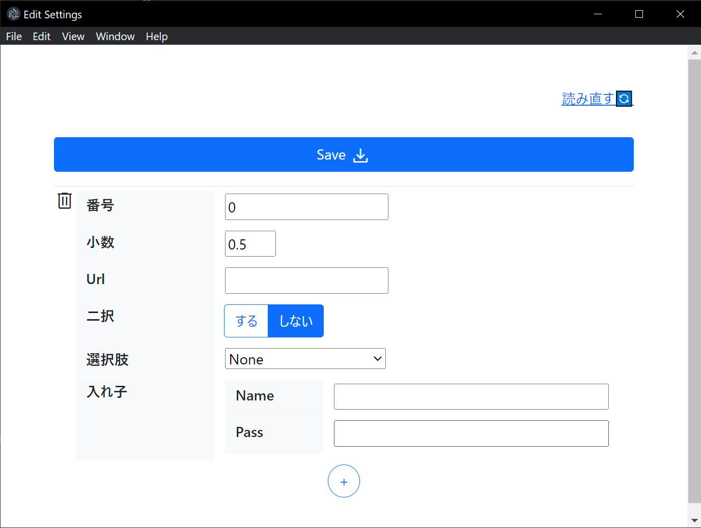

# JSON Editor Application

このアプリケーションは、JSON ファイルを編集するための簡易的なエディターを提供します。起動時に指定した JSON ファイルを読み込み、インターフェースを作成します。



## Download and Installation

アプリケーションのインストーラー、プラグインディレクトリのサンプル、およびテスト用の JSON ファイルは、このリポジトリの [リリース](https://github.com/zukio/json-editor/releases) ページからダウンロードできます。

1. リリースページへ移動し、最新の「JSON Editor」を探します。
2. アセットセクションに移動し、以下のファイルをダウンロードします：
   - インストーラー（json-editor.Setup.1.0.0.exe）
   - カスタマイズのサンプル（plugins ディレクトリと test.json ファイル）
3. インストーラーを実行してアプリケーションをインストールします。
4. プラグインディレクトリと test.json ファイルを適切な場所に配置し、アプリケーションにパスを指定します。

## Usage

起動時引数にて、JSON ファイル（またはプラグイン）のパスを指定します。起動時引数は以下のような操作を行うことで設定可能です：

1. アプリケーションの exe ファイルを右クリックし、[ショートカットを作成]を選択します。
2. ショートカットを右クリックし、[プロパティ]を選択します。
3. [ショートカット]タブの[ターゲット]フィールドに起動時引数を追加します。

### 例：

```javascript
"C:\Path\To\json-editor.exe" --jsonFile="./test.json"
```

また、アプリケーションは以下の 2 つの方法で起動できます。

1. JSON ファイルのみを指定する場合（全ての入力フィールドは`type=text`で表示されます）：

   ```
   json-editor.exe --jsonFile="./test.json"
   ```

2. カスタムプラグインを指定する場合：

   ```
   json-editor.exe --plugins="./plugins"
   ```

   プラグインは JSON の各フィールドに対するラベル、入力タイプ、デフォルト値、制約等を定義するものです。

## Customizing the editor

プラグインファイル (plugins.js) を編集することで、エディターの挙動をカスタマイズできます。このファイルには 2 つの主要なオブジェクトがあります：fieldConfig と changeStyle。

### JSON ファイル

プラグインを使用する場合は、プラグインファイル (plugins.js) からエディターが編集する JSON ファイルを指定します。相対パスまたは絶対パスを使用できます。

```javascript
const jsonFile = "../test.json";
```

### fieldConfig

このオブジェクトは各フィールドのデフォルト値、ラベル、必須項目かどうか、選択肢（選択ボックスの場合）、文字列や数字の範囲（正規表現や最小値/最大値を使用）などを定義します。

例：

```javascript


const fieldConfig = {
  "Int": {
    initial: -1, // デフォルト値
    label: "番号", // ラベル
    required: true, // 必須かどうか
  },
  ...
  "Object": {
    initial: {
      "Name": "",
      "Pass": "",
    },
    label: "入れ子",
  },
};
```

各プロパティには以下のオプションが存在します:

- `initial`: フィールドのデフォルト値。デフォルト値を元にフィールドの型を定義します。指定しない場合は空文字列("")が使用されます。
- `label`: フィールドのラベル。指定しない場合はフィールドのキーが使用されます。
- `required`: フィールドが必須かどうかを指定します。指定しない場合は`true`が使用されます。
- `selection`: 選択ボックスの選択肢を配列として指定します。指定しない場合、選択ボックスは存在しません。
- `map`: 数字または文字列の範囲を指定します。指定しない場合、範囲チェックは存在しません。
- `pattern`: 正規表現を使用して文字列の形式を指定します。指定しない場合、形式チェックは存在しません。

### changeStyle

このオブジェクトは特定のフィールドの値が変更されたときに特定の操作（他のフィールドの表示/非表示切り替えなど）を行うためのルールを定義します。

例：

```javascript
const changeStyle = {
  "Boolean": {
    if: true,
    condition: "!=",

    targets: ["Object"],
    toggleclass: ["d-none"],
  },
};
```

各プロパティには以下のオプションが存在します:

- `if`: 条件式の左側の値です。
- `condition`: 条件式の比較演算子です。現在、`"=="`と`"!="`がサポートされています。
- `targets`: 条件式が真のときに操作を適用するフィールドのキーのリストです。
- `toggleclass`: 条件式が真のときに適用する CSS クラスのリストです。このクラスは対象フィールドに追加され（条件式が偽の場合は削除され）ます。

このプロジェクトをカスタマイズすることで、開発者は特定の JSON フォーマットに合わせたデータエディターを作成できます。特定のフィールドに特定の制約を適用したり、特定の操作を自動化したりすることで、ユーザーは安全に JSON を編集できるようになり、編集するデータの正確性と一貫性を確保できます。
